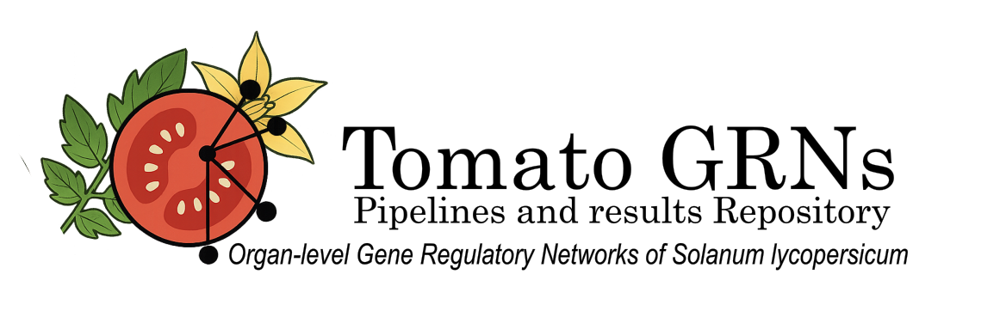

  

**Citation:**  
*Organ-level Gene Regulatory Network models enable the identification of central transcription factors in* *Solanum lycopersicum* (2025-04-01)  
doi: [https://doi.org/10.1101/2025.03.26.645553](https://doi.org/10.1101/2025.03.26.645553)

---

Welcome to the **Tomato Gene Regulatory Networks (GRNs) Pipelines Repository**.  
This repository hosts a comprehensive collection of scripts and resources developed for the construction and analysis of **organ-specific GRNs in tomato (*Solanum lycopersicum*)**, as presented in the study referenced above.

### 🧰 What’s Included

This repository provides:

🧬 **Preprocessing pipelines** for multi-omic data types:
  - ATAC-seq
  - ChIP-seq
  - DAP-seq

🔄 A modular pipeline to infer GRNs using the **GENIE3** algorithm

🌐 The **final organ-level GRN models** generated from integrating the regulatory evidence from these analyses

Each component of this repository is designed to ensure **reproducibility**, **modularity**, and ease of use across diverse experimental setups and datasets.

---

### 📚 Usage & Contribution

We invite researchers to explore and adapt these pipelines for their own analyses.  
If you find this resource helpful, please **cite the associated publication** and feel free to open issues or pull requests for improvements and collaborations.

---

Thank you for your interest in our work on tomato transcriptional regulation.  
We hope this resource supports and accelerates your plant genomics research!
